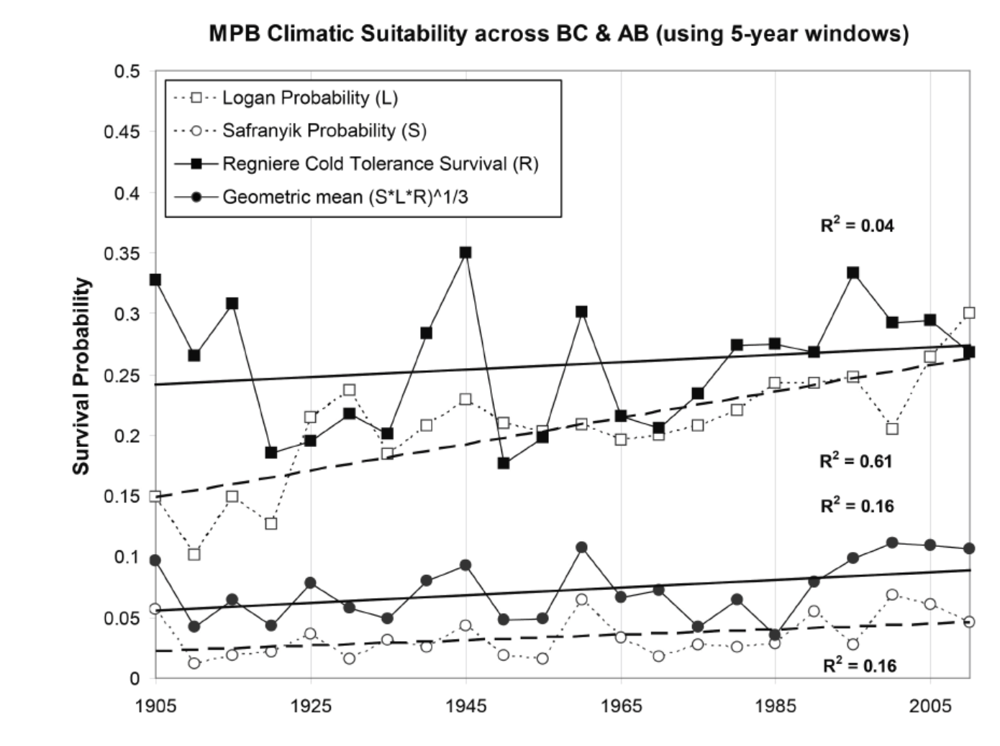

## Summary

This module imports several MPB climate suitability scenarios (using four different indices: `S`, `L`, `R`, `G`) for use as model drivers.
The Logan suitability index (`L`) is based on summer temperatures [@Logan:2003fr].
The Regniere suitability index (`R`) is based on MPB cold tolerance (*i.e.*, winter survival) [@Regniere:2007ip].
The Safranyik suitability index (`S`) is based on aspects of both summer temperatures and winter survival [@Safranyik:1975bk].
Finally, the composite SLR index (`G`) takes the harmonic mean of the `S`, `L`, and `R` models.
These are described in further detail in @Nealis:2008gc (and the updated @Nealis:2014re ?), and of course in their respective publications cited above.
BioSim was used to generate the maps [see @Bentz:2010bs; @Logan:2003fr; @Safranyik:2010ce].

```{r scenario-table, echo=FALSE}
scenarios <- data.frame(
  index = c('S', 'L', 'R', 'G'),
  description = c('Safranyik', 'Logan', 'Regniere', 'Composite'),
  stringsAsFactors = FALSE
)
knitr::kable(scenarios)
```

For each of the four indices, there are 1981-2010 normals plus the projections from two RCP scenarios (either 4.5 or 8.5), covering a span of 120 years, split into 30-year frames.

All maps are projected using LCC and cover all of Canada.

The default is to use the composite index (`G`).


