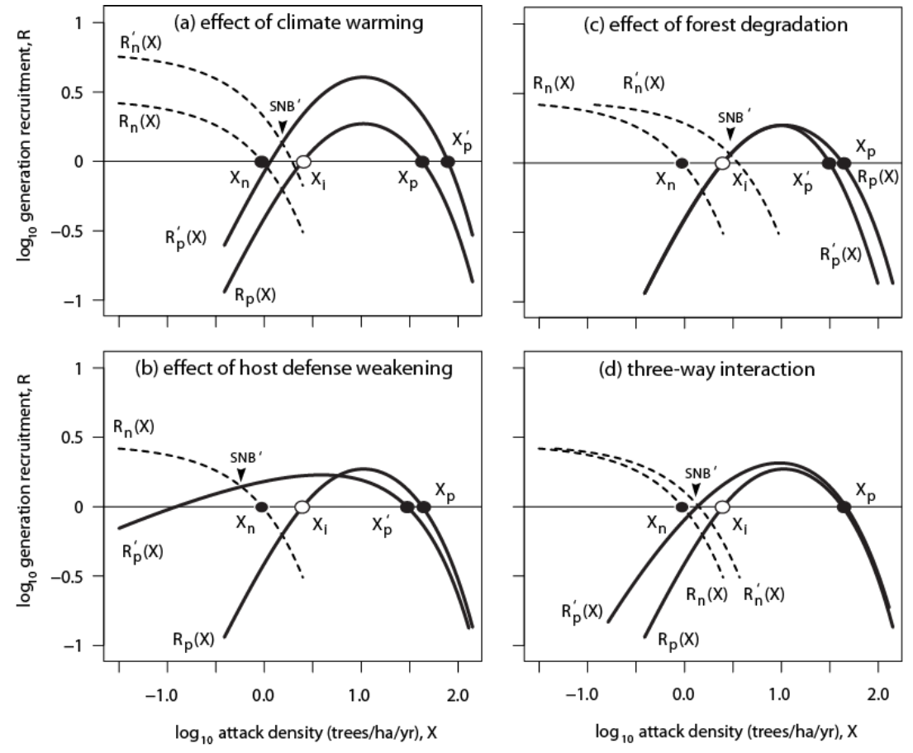

## Summary

Recruitment is an annual process, with the inter-annual recruitment function taking a variety of possible forms, depending who one takes as an authority on the question.
@Berryman:1979bs was an early pioneer who inspired much work in the area, and there are several possible interpretation of the data he used from Glacier and Yellowstone National Parks in Montana (MT) and Wyoming (WY) the 1960s.
Consequently, the module offers the option of using any of four possible interpretations (`Berryman1979_fit`, `Berryman1979_forced` (current default)).
Two addiitonal options are forthcoming.

The first of these is a high-order polynomial fit to Berryman's hand-drawn curve (`Berryman1979_fit`).
The second is the linearized multi-niche model of @Berryman:1999bk, which, oddly & inexplicably, held endemic-niche dynamics as a fast process (`R[t] ~ X[t-1]`), and epidemic-niche dynamics as a lagged process (`R[t] ~ X[t-2]`) (`Berryman1979_forced`).

## Climate and other impacts on recruitment

