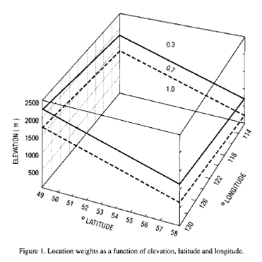
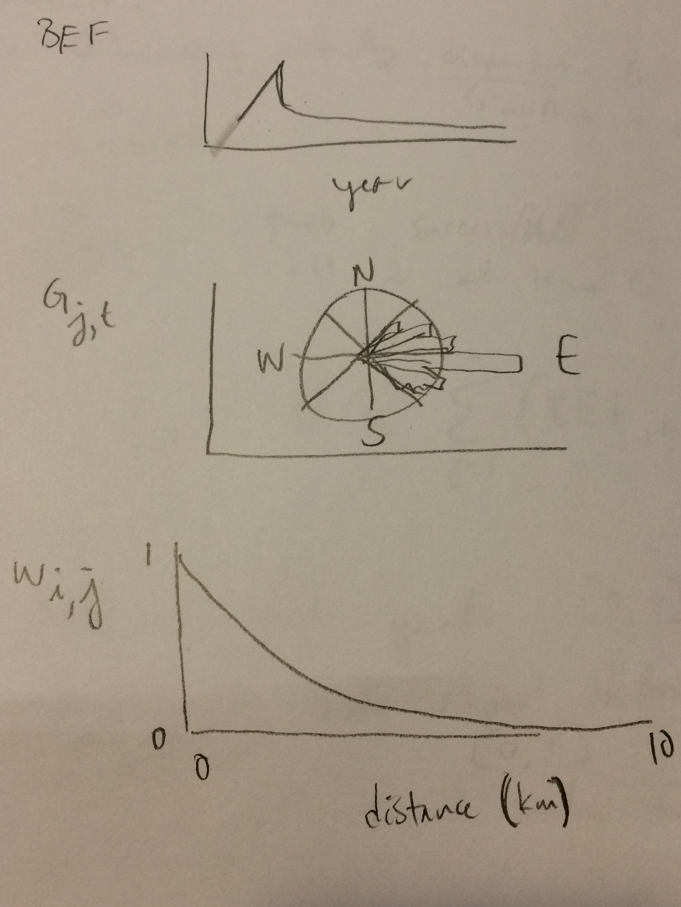

```{r setup, include=FALSE}
knitr::opts_chunk$set(echo = FALSE)
```

## Overview

My notes on the `MPBSpread` model presented at the fRI MPB Workshop held in Edmonton, AB on October 26, 2016.

This workshop was live streamed at [youtube.com/watch?v=ChdU__G21Cs](https://www.youtube.com/watch?v=ChdU__G21Cs).

**Presenter:** Clive Welham (UBC)

- `MPBSpread` is a spatially explicit model on a forest landscape
- 10-20 year horizon
- uses 400 m x 400 m (16 ha) cells
- stochasticity
- no life history; only dispersal (with mortality) within and among stands
- univoltine dynamics

Barry's summary:

> logistic stochastic cellular automaton at 16 ha resolution, driven by numerous environmental variables known to have nonlinear influence on probability of establishment.

## Model construction

The model calculates the probability of successful colonization of unoccupied cell $i$ at time $t$:

$$P_{i,t} = HQ_i \sum_{j=1}^{n}{BEF_{j,t} G_{j,t} W_{i,j}}$$

- $HQ_i$ is habitat quality scaled from $0$ to $1$;
    It is simply the Shore-Safranyik [-@Shore:1992rs] "stand susceptibility index" (SSI):

    - $HQ_i = P A D L$
    - $P$ is the percentage of susceptible pine (data source??)
    - $A$ is age [of cell??]
    - $D$ is density [of pine??]
    - $L$ is a location factor
    
        - From Barry:
        
            > The 'Location factor' is a heuristic joke that should break down in Alberta.
            > It was a quick & dirty attempt to include presumed weather effects of latitude and elevation in BC.
            > They should have used Safranyik'’'s (1975) Climatic Suitability Index, but this was back in the say when such things were "hard".
            > This is `S`, incidentally, in the SpaDES-BioSIM MPB climatic suitability library.
    
        

- $BEF_{j,t}$ is a 'beetle export factor', which is an index of dispersal from occupied cell, scaled from $0$ to $1$;

    - linear increase then exponential decline
    
    - From Barry:
    
        > All of our experience with MPB and SBW indicates that dispersal involves risk-taking, and the reward:risk ratio is maximized when host forest resources are reaching depletion.
        > So dispersal proportions and distances ought to be dependent on how much how forest remains after depredation/defoliation.
        >
        > This choice will have a pretty strong influence on overall spread rates, especially when there is a strong Allee effect in the probability of establishing post-dispersal, which is definitely the case for MPB, and somewhat so for defoliators such as SBW and GM (gypsy moth).
        >
        > When the insect adjusts its dispersion propensity according to residual habitat, it gives the opportunity for successful "Levy flights"" – fat-tailed dispersal kernels that lead to more successful long-distance colonization and hence more rapid spread.
        > If they don’t disperse in clumps, then they will over-disperse and those long-range dispersers will fail to establish, leading to slow rates of spread.
        >
        > Rates of spread through marginal habitat will be incredibly sensitive to small differences in assumptions on the nonlinear dynamics of dispersal and establishment.

- $G_{j,t}$ is a directional scaler for wind, between $0$ and $1$;

    - circular frequency distribution of wind directions (biased eastward)

- $W_{i,j}$ is a weighting factor for distance from unoccupied to occupied cells, between $0$ and $1$.

    - approx. exponential decline, but it's modified to be non-monotonic (flat-tailed distribution) that declines from weight $1$ at distance $0$ km to near $0$ at $10$ km.



Cumulative probability of occurrence follows a logistic curve, with two different curves defined for:

1. 'experienced' pine, which has an evolutionary history of MPB outbreak (*i.e.*, BC);
2. 'naive' pine, which doesn't have this history (*i.e.*, AB)

Experienced pine has a lower curve than naive pine (MPB less likely to occur in a cell).


### Model summary

- captures short-distance "diffusive" dispersal as well as larger-distance "jumps" [unclear how...]
- model accounts for:

    - infested trees at stand and landscape levels
    - stand susceptibility
    - [beetle] mortality
    - MPB reproductive output (including climate effects)
    - habitat connectivity
    - [beetle] dispersal
    - beetle control

- From Barry:

    > It is a phenomenological model.
    > The relevant biology is captured in the 'r value', which is predicted by tree size, size of attack cluster, and elevation (which vary in space) and minimum winter temperature (which varies in space and time).
    > Things like competition and natural enemies etc. are subsumed in the phenomenological nonlinear "probability of successful colonization"" of a 16 ha patch.
    > The model was tested in lodgepole pine in eastern BC and western AB and was very accurate, as you'd expect from a model built on measured r-values, which are very, very costly to obtain -– so costly that BC doesn't bother.
    > (Well, Elizabeth Campbell does have one dataset worth examining, but that's another story.)

## Implementing control

- **level 1:**

    - cells where infestation detected $\le 2$ years of establishment
    - a proportion of green attack trees is removed
    
- **level 2:**

    - cells with infestation $\ge 3$ years and $\le 7$ km from a road; else no treatment
    - all trees removed

## Application control

- "leading edge focused"
- begin with cell at easternmost  longitude and highest latitude
- proceed sequentially by longitude to southernmost cell, then onte northernmost cell to the west
- continue until all cells sampled or total area allocated for control in that year is reached
s each infested cell has probability of being detected ($P_{detect} = 0.90$) and subsequent probability of successful eradication ($P_{eradicate} = 0.65$)

## Model validation

`MPBSpread` validated using BC survey data 1999 for the Burns Lake -- Quesnel -- etc. region.

- 10 model runs to account for stochasticity
- get means and 95% confidence intervals for two metrics:

    1. total area infested
    2. total pine killed

- spread projections were compared to data

## Model application

`MPBSpread` applied to AB region using 2008-2015 data from Alberta Agriculture and Forestry.

- used 'naive' pine curve for thresholds
- used 2008 data to set initial conditions
- two scenarios considered:

    1. 'do nothing'
    2. 'business as usual'
    
        - level 1 control: 10,000 ha
        - level 2 control: 1,500 ha in 2008 increasing to 3,000 ha in 2017
        - $P_{detect} = 0.90$
        - $P_{eradicate} = 0.65$

### Conclusions

1. survey data match reasonably well;
2. control does make a difference;
3. control efficacy is not immediately apparent -- it takes time to manifest.

- From Barry:

    > The average rate of control efficacy (of both suppression and spread limitation) – in the areas where suitable data could be obtained (a very important caveat) - was 40%.
    > There are places (again, in that tongue of western Alberta) where the rate of control is lower and higher, depending principally on initial attack density, the level of effort, and the year in which control is initiated.
    > bsent from their presentation was any analysis or simulation in hybrid or jack pine, where control efficacy may be as high as 100%, and where large fires (such as the Slave fire of 2011 and the Fort Mac fire of 2016) are far more common.

### Other model applications

Also explored different combinations of 'do nothing' and 'business as usual' for different amounts of level 1 and level 2 control.

## Comments

From email discussions.

### from Barry

- Their model is a "twitch model" describing fast dynamics of eruption, not the slow dynamics of coupled forest-insect feedbacks.
  The long-range "slow-the-spread" cannot be answered without forest depletion and climate change as drivers.

- Formulated at a resolution of 16 ha and representing establishment & eruption as a simple logistic process removes a lot of detail.
  It's going to be good enough over large extents and small time frames where details don't matter. Hence the quality of their validations in BC and AB. OTOH a lot of their simulated stochasticity (those wide confidence intervals) is going to come from (mis) representing a continuous growth process as binary.
  That misrepresentation error grows as time horizon (and other process uncertainty) grows.

- The single biggest limitation in their modeling approach is that it doesn't connect to forest depletion and regrowth, and has no capacity to connect to other people's models of forest growth, weather, climate, fire occurrence, and so on.

- Note that they "reinvented the wheel"" of trying to re-estimate the weather effect on r value.
  `SpaDES` seeks to avoid that duplicity.

- Note that they have no capacity for dynamically re-parameterizing their efficacy model when the 2015, 2016 data come in.
  Recall that question: "We think we're better now in the last three years than the first seven years. Can you re-estimate your detection and control efficacy parameters?".
  Allan's reply was that it required a boatload of GIS data pre-processing, none of it scripted.
  Again, that's what `SpaDES` workflows are for.

- re: habitat connectivity -- The primary agent for increased fragmentation is likely to be … fire. Hence the notes from last week bout the FortMac fires and the CLAWR.

- This team should not, and probably will not, build a "DSS".
    Alberta has one already that they like.
    It can be tweaked if necessary, but many of the critical thresholds identified in this model are already known to ASRD/AAF, and are used in their treatment decisions.
    Saskatchewan does not currently have (and likely never will have) the technical capacity to run a "DSS" for any pest.
    They often must rely on consultants bringing them results (*e.g.*, from LANDIS), which they then choose to adopt or ignore.
    Manitoba is the same.
    These provinces would be willing to work with a developer's community to help synthesize science to get it into the hands of decision-makers, but they will never install software systems and learn how to run them.
    They simply don't have the capacity in their forestry departments.
    Ontario is a little bit the same, frankly.
    Quebec always takes its own approach because of its politics.
    NB is more like BC.
    They DO have capacity for DSS.

- How does this MPBspread model compare to `MPB-SELES`? This team has no real capacity or interest in inter-model comparison or integration.
    Their next steps are economics, not integration.

- So … `SpaDES` has both the logic model and the business model that the actual pest "DSS"" marketplace needs.
    `SpaDES` solves a problem that has plagued Canada since forever: timber branches and forest health and fish & wildlife branches are always separate.
    Policy & operations are separate. 
    `SpaDES` solves the integration problem posed by administrative separation.

- How would their phenomenological model compare to a process model?
    Well, for one, I identified four sharp nonlinearities where they are using smooth approximations (to statistically test a hypothesis rather than describe a process).
    These smooth approximations tend to under-estimate eruptiveness.
    These will not matter much when MPB are pouring into AB from BC by the billions (which is where the spread model was tested), but it will matter when MPB are struggling to make it on the margins, where small differences matter most.

 - A population model that pays closer attention to sharp nonlinearities will reveal the spread problem to be that of a knife's edge.
     Press just a little too hard and the MPB cut through the landscape like a knife.
     This aspect of the system's dynamics was totally de-emphasized by this presentation.

## References

<!-- automatically generated using bibliography.bib -->
